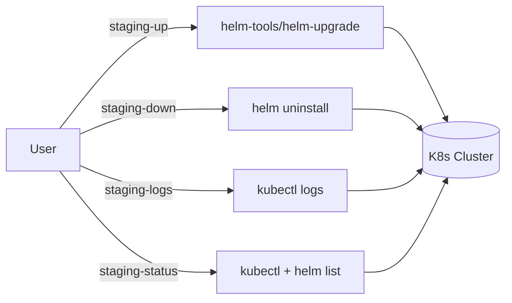

# Project Architecture — staging-tools

## Overview

A lightweight CLI toolkit for managing Kubernetes staging environments. Four shell scripts handle the full staging lifecycle — deploy, teardown, log tailing, and status inspection. Scripts are installed to `~/.local/bin` via a Makefile and expect a Kubernetes cluster with Helm, KEDA, and optionally metrics-server.

## System Diagram

## Core Components

| Component | Purpose |
|-----------|---------|
| `bin/staging-up` | Deploy all staging services via `helm-upgrade --env stage` |
| `bin/staging-down` | Uninstall all Helm releases in the staging namespace |
| `bin/staging-logs` | Tail logs for a named staging service (frontend, backend, etc.) |
| `bin/staging-status` | Show Helm releases, pods, KEDA ScaledObjects, and resource usage |
| `Makefile` | Install scripts to `$INSTALL_DIR` (default `~/.local/bin`) |

## Environment Variables

| Variable | Default | Used By |
|----------|---------|---------|
| `K8_STAGING_NAMESPACE` | `staging` | staging-down, staging-logs, staging-status |
| `K8_APP_PREFIX` | `app` | staging-logs (label selector construction) |

## External Dependencies

- **helm-tools/helm-upgrade** — sibling utility at `../helm-tools/helm-upgrade`, invoked by `staging-up`
- **Helm 3** — release management (list, uninstall)
- **kubectl** — pod inspection, log tailing, metrics
- **KEDA** — optional; staging-status reports ScaledObject state

## Key Decisions

- **Thin wrappers over Helm/kubectl**: Scripts add convention (namespace defaults, label patterns) without abstracting away the underlying tools
- **KEDA-aware**: staging-logs detects scale-to-zero and suggests waking the service instead of failing silently
- **No built-in secret management**: Secrets are handled by the broader infra (Infisical), not by these scripts
