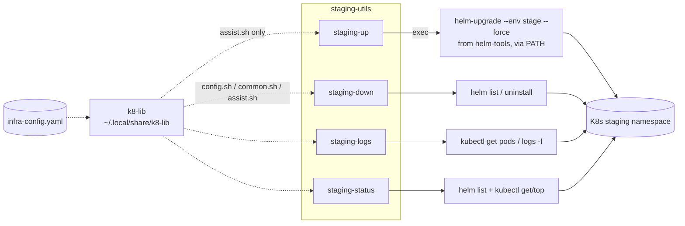

# Project Architecture — staging-utils

## Overview

`staging-utils` is a terminal utility package: four small bash scripts (`bin/staging-up`, `staging-down`, `staging-logs`, `staging-status`) that manage the staging environment lifecycle on the Noizu k8s cluster — deploy, teardown, log tailing, and status inspection. The scripts are thin, convention-driven wrappers over `helm` and `kubectl`; all shared logic (config resolution, common helpers, AI `--assist` help) lives in the external `k8-lib` shell library.

It is one package in the Noizu utilities ecosystem: `make install` (or `make install-utilities` at the monorepo root) copies `bin/staging-*` into `~/.local/bin`, alongside sibling packages like `helm-tools` whose `helm-upgrade` command `staging-up` depends on via `$PATH`.

## System Diagram

```mermaid
graph LR
    subgraph staging-utils
        Up[staging-up]
        Down[staging-down]
        Logs[staging-logs]
        Status[staging-status]
    end

    Lib[k8-lib<br/>~/.local/share/k8-lib] -.->|config.sh / common.sh / assist.sh| Down
    Lib -.-> Logs
    Lib -.-> Status
    Lib -.->|assist.sh only| Up
    Cfg[(infra-config.yaml)] -.-> Lib

    Up -->|exec| HU[helm-upgrade --env stage --force<br/>from helm-tools, via PATH]
    Down --> Helm[helm list / uninstall]
    Logs --> KL[kubectl get pods / logs -f]
    Status --> KS[helm list + kubectl get/top]

    HU --> K8s[(K8s staging namespace)]
    Helm --> K8s
    KL --> K8s
    KS --> K8s
```

## Core Components

| Component | Purpose |
|-----------|---------|
| `bin/staging-up` | 8-line shim: `exec helm-upgrade --env stage --force "$@"` (helm-tools, resolved via `$PATH`) |
| `bin/staging-down` | Iterates `helm list -n <ns> -q` and `helm uninstall --wait`s each release |
| `bin/staging-logs` | Resolves service → label `app.kubernetes.io/name=<prefix>-<service>`, tails `kubectl logs --follow --all-containers`; frontend by default |
| `bin/staging-status` | Dashboard: Helm releases, pods (`-o wide`), KEDA ScaledObjects, `kubectl top` resource usage |
| `Makefile` | `make install` → installs the four scripts to `$INSTALL_DIR` (default `~/.local/bin`); `compile`/`test` are no-ops |

→ *Components ↔ directories: see [PROJ-LAYOUT.md](PROJ-LAYOUT.md)*

## Configuration Chain

Scripts source `config.sh`, `common.sh`, and `assist.sh` from k8-lib (`K8_LIB_DIR`, default `~/.local/share/k8-lib`). Each script pre-parses `--config <path>` into `K8_CONFIG` *before* sourcing, so an alternate `infra-config.yaml` takes effect during config resolution. `staging-up` skips the config chain entirely (helm-upgrade does its own) and only wires in `assist.sh` when present.

| Setting | YAML path | Env override | Default |
|---------|-----------|--------------|---------|
| Staging namespace | `.kubernetes.staging_namespace` | `K8_STAGING_NAMESPACE` | `staging` |
| App label prefix | `.kubernetes.app_prefix` | `K8_APP_PREFIX` | `app` |

→ *Full config/env/CLI artifact reference (including the no-persistence note): [PROJ-SCHEMA.md](PROJ-SCHEMA.md)*

## External Dependencies

- **k8-lib** — shared shell library (config chain, `--assist` AI help); installed by repo-root `make install-utilities`
- **helm-tools / helm-upgrade** — must be on `$PATH` for `staging-up`
- **Helm 3** and **kubectl** — release management, pod inspection, log tailing
- **KEDA** (optional) — staging-status reports ScaledObject state; metrics-server (optional) for `kubectl top`

## Key Decisions

- **Thin wrappers, no `lib/`**: scripts add convention (namespace defaults, label patterns) without abstracting Helm/kubectl; shared code stays in k8-lib so all Noizu utilities behave consistently
- **`--config` pre-parse**: config path must be known before k8-lib's `config.sh` runs, so each script scans `$@` for `--config` up front
- **KEDA scale-to-zero aware**: `staging-logs` exits 0 with a wake-up hint (run `staging-status`, curl the staging URL) instead of failing when no pods match
- **`staging-up` is a pure shim**: deployment logic (env overlays, chart selection) belongs to `helm-upgrade`; `--force` ensures staging redeploys even without chart changes
- **No secret management**: secrets flow through the broader infra (Infisical → k8s Secrets), never through these scripts
